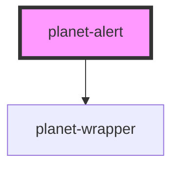

# planet-alert

<!-- Auto Generated Below -->

## Properties

| Property   | Attribute  | Description | Type                                                                                                                  | Default     |
| ---------- | ---------- | ----------- | --------------------------------------------------------------------------------------------------------------------- | ----------- |
| `severity` | `severity` |             | `PlanetAlertSeverity.ERROR \| PlanetAlertSeverity.INFO \| PlanetAlertSeverity.SUCCESS \| PlanetAlertSeverity.WARNING` | `undefined` |

## Dependencies

### Depends on

- [planet-wrapper](../planet-wrapper)

### Graph

----------------------------------------------

*Built with [StencilJS](https://stenciljs.com/)*
