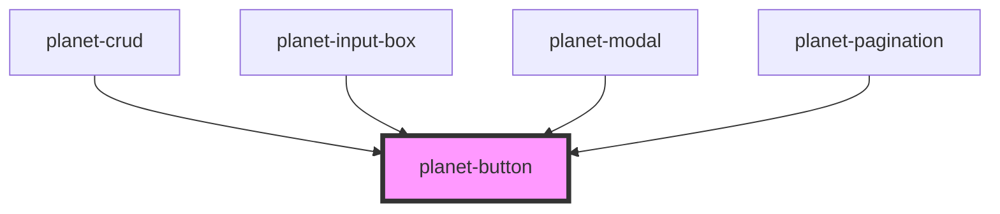

# planet-button

<!-- Auto Generated Below -->

## Properties

| Property    | Attribute     | Description | Type                                                | Default     |
| ----------- | ------------- | ----------- | --------------------------------------------------- | ----------- |
| `disabled`  | `disabled`    |             | `boolean`                                           | `undefined` |
| `form`      | `form`        |             | `string`                                            | `undefined` |
| `full`      | `full`        |             | `boolean`                                           | `undefined` |
| `pTabIndex` | `p-tab-index` |             | `number`                                            | `undefined` |
| `selected`  | `selected`    |             | `boolean`                                           | `undefined` |
| `severity`  | `severity`    |             | `"error" \| "success"`                              | `undefined` |
| `size`      | `size`        |             | `"large" \| "lg" \| "md" \| "mini" \| "sm" \| "xs"` | `'large'`   |
| `type`      | `type`        |             | `"button" \| "submit"`                              | `'submit'`  |

## Dependencies

### Used by

 - [planet-crud](../planet-crud)
 - [planet-input-box](../planet-input-box)
 - [planet-modal](../planet-modal)
 - [planet-pagination](../planet-pagination)

### Graph

----------------------------------------------

*Built with [StencilJS](https://stenciljs.com/)*
