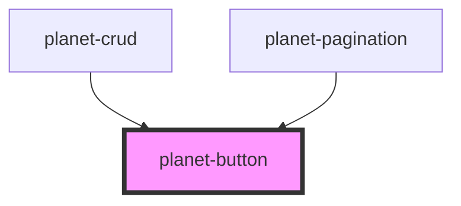

# planet-button

<!-- Auto Generated Below -->

## Properties

| Property   | Attribute  | Description | Type                                                         | Default     |
| ---------- | ---------- | ----------- | ------------------------------------------------------------ | ----------- |
| `disabled` | `disabled` |             | `boolean`                                                    | `undefined` |
| `form`     | `form`     |             | `string`                                                     | `undefined` |
| `full`     | `full`     |             | `boolean`                                                    | `undefined` |
| `severity` | `severity` |             | `PlanetButtonSeverity.ERROR \| PlanetButtonSeverity.SUCCESS` | `undefined` |
| `size`     | `size`     |             | `"large" \| "mini"`                                          | `'large'`   |
| `type`     | `type`     |             | `"button" \| "submit"`                                       | `'submit'`  |

## Dependencies

### Used by

 - [planet-crud](../planet-crud)
 - [planet-pagination](../planet-pagination)

### Graph

----------------------------------------------

*Built with [StencilJS](https://stenciljs.com/)*
