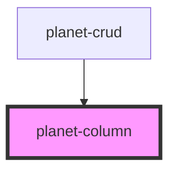

# planet-column

<!-- Auto Generated Below -->

## Properties

| Property | Attribute | Description | Type     | Default     |
| -------- | --------- | ----------- | -------- | ----------- |
| `large`  | `large`   |             | `number` | `undefined` |
| `medium` | `medium`  |             | `number` | `undefined` |
| `small`  | `small`   |             | `number` | `undefined` |
| `xlarge` | `xlarge`  |             | `number` | `undefined` |
| `xsmall` | `xsmall`  |             | `number` | `undefined` |

## Dependencies

### Used by

 - [planet-crud](../planet-crud)

### Graph

----------------------------------------------

*Built with [StencilJS](https://stenciljs.com/)*
