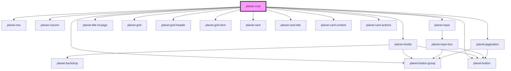

# planet-crud

<!-- Auto Generated Below -->

## Properties

| Property              | Attribute       | Description | Type                                                                                                                                                                                                                                                                   | Default     |
| --------------------- | --------------- | ----------- | ---------------------------------------------------------------------------------------------------------------------------------------------------------------------------------------------------------------------------------------------------------------------- | ----------- |
| `allowedItemsPerPage` | --              |             | `number[]`                                                                                                                                                                                                                                                             | `undefined` |
| `columns`             | --              |             | `{ key: string; label: string; showInGrid: boolean; type: "autocomplete" \| "select" \| "text" \| "time" \| "toggle"; validators: any[]; defaultValue?: PlanetValueInterface<any>; showAs?: "primaryCode" \| "primaryName" \| "secondaryCode" \| "secondaryName"; }[]` | `undefined` |
| `data`                | --              |             | `any[]`                                                                                                                                                                                                                                                                | `undefined` |
| `page`                | `page`          |             | `number`                                                                                                                                                                                                                                                               | `1`         |
| `titleOfForm`         | `title-of-form` |             | `string`                                                                                                                                                                                                                                                               | `undefined` |
| `totalItems`          | `total-items`   |             | `number`                                                                                                                                                                                                                                                               | `undefined` |

## Events

| Event         | Description | Type                  |
| ------------- | ----------- | --------------------- |
| `itemAdd`     |             | `CustomEvent<object>` |
| `itemDeleted` |             | `CustomEvent<object>` |
| `itemSearch`  |             | `CustomEvent<object>` |
| `itemUpdate`  |             | `CustomEvent<object>` |

## Methods

### `closeForm() => Promise<void>`

#### Returns

Type: `Promise<void>`

### `openForm(state: 'put' | 'post', row?: any) => Promise<void>`

#### Returns

Type: `Promise<void>`

### `setColumnValue(key: any, valuePair: any) => Promise<void>`

#### Returns

Type: `Promise<void>`

## Dependencies

### Depends on

- [planet-modal](../planet-modal)
- [planet-row](../planet-row)
- [planet-column](../planet-column)
- [planet-input](../planet-input)
- [planet-button](../planet-button)
- [planet-title-of-page](../planet-title-of-page)
- [planet-pagination](../planet-pagination)
- [planet-button-group](../planet-button-group)
- [planet-grid](../planet-grid)
- [planet-grid-header](../planet-grid-header)
- [planet-grid-item](../planet-grid-item)
- [planet-card](../planet-card)
- [planet-card-title](../planet-card-title)
- [planet-card-content](../planet-card-content)
- [planet-card-actions](../planet-card-actions)

### Graph

----------------------------------------------

*Built with [StencilJS](https://stenciljs.com/)*
