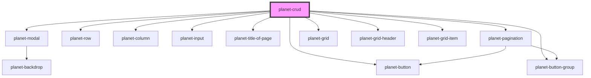

# planet-crud

<!-- Auto Generated Below -->

## Properties

| Property      | Attribute       | Description | Type                                              | Default                                                                                                                                                                                                                                                                                                                                                                                                                                                                                                                                                                                                                      |
| ------------- | --------------- | ----------- | ------------------------------------------------- | ---------------------------------------------------------------------------------------------------------------------------------------------------------------------------------------------------------------------------------------------------------------------------------------------------------------------------------------------------------------------------------------------------------------------------------------------------------------------------------------------------------------------------------------------------------------------------------------------------------------------------- |
| `columns`     | --              |             | `{ key: string; label: string; type: string; }[]` | `[       {         key: 'id',         label: 'ID',         type: 'text'       },       {         key: 'shortName',         label: 'Short Name',         type: 'text'       },       {         key: 'longName',         label: 'Long Name',         type: 'text'       },       {         key: 'country',         label: 'Country',         type: 'text'       },     ]`                                                                                                                                                                                                                                                      |
| `data`        | --              |             | `any[]`                                           | `[     {       id: {         description: 'x',         value: 'x',       },       shortName: {         description: 'x',         value: 'x',       },       longName: {         description: 'x',         value: 'x',       },       country: {         description: 'x',         value: 'x',       },     },     {       id: {         description: 'x',         value: 'x',       },       shortName: {         description: 'x',         value: 'x',       },       longName: {         description: 'x',         value: 'x',       },       country: {         description: 'x',         value: 'x',       },     }   ]` |
| `page`        | `page`          |             | `number`                                          | `undefined`                                                                                                                                                                                                                                                                                                                                                                                                                                                                                                                                                                                                                  |
| `pages`       | `pages`         |             | `number`                                          | `undefined`                                                                                                                                                                                                                                                                                                                                                                                                                                                                                                                                                                                                                  |
| `titleOfForm` | `title-of-form` |             | `string`                                          | `undefined`                                                                                                                                                                                                                                                                                                                                                                                                                                                                                                                                                                                                                  |

## Events

| Event         | Description | Type                  |
| ------------- | ----------- | --------------------- |
| `itemAdd`     |             | `CustomEvent<object>` |
| `itemDeleted` |             | `CustomEvent<object>` |
| `itemUpdate`  |             | `CustomEvent<object>` |

## Methods

### `closeForm() => Promise<void>`

#### Returns

Type: `Promise<void>`

### `openForm(state: 'put' | 'post') => Promise<void>`

#### Returns

Type: `Promise<void>`

## Dependencies

### Depends on

- [planet-modal](../planet-modal)
- [planet-row](../planet-row)
- [planet-column](../planet-column)
- [planet-input](../planet-input)
- [planet-button](../planet-button)
- [planet-title-of-page](../planet-title-of-page)
- [planet-pagination](../planet-pagination)
- [planet-button-group](../planet-button-group)
- [planet-grid](../planet-grid)
- [planet-grid-header](../planet-grid-header)
- [planet-grid-item](../planet-grid-item)

### Graph

----------------------------------------------

*Built with [StencilJS](https://stenciljs.com/)*
