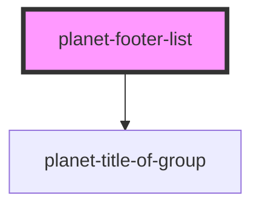

# planet-footer-list

<!-- Auto Generated Below -->

## Properties

| Property      | Attribute       | Description | Type     | Default     |
| ------------- | --------------- | ----------- | -------- | ----------- |
| `titleOfList` | `title-of-list` |             | `string` | `undefined` |

## Dependencies

### Depends on

- [planet-title-of-group](../planet-title-of-group)

### Graph

----------------------------------------------

*Built with [StencilJS](https://stenciljs.com/)*
