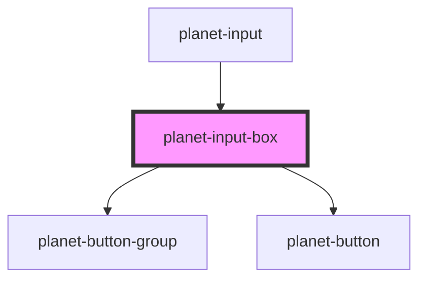

# planet-input-box

<!-- Auto Generated Below -->

## Properties

| Property     | Attribute   | Description | Type                                             | Default     |
| ------------ | ----------- | ----------- | ------------------------------------------------ | ----------- |
| `label`      | `label`     |             | `string`                                         | `undefined` |
| `showHelp`   | `show-help` |             | `boolean`                                        | `false`     |
| `validators` | --          |             | `(() => Validator<PlanetValueInterface<any>>)[]` | `[]`        |
| `value`      | --          |             | `PlanetValueInterface<any>`                      | `undefined` |

## Events

| Event    | Description | Type                |
| -------- | ----------- | ------------------- |
| `pClear` |             | `CustomEvent<void>` |
| `pFocus` |             | `CustomEvent<void>` |
| `pHelp`  |             | `CustomEvent<void>` |

## Dependencies

### Used by

 - [planet-input](../planet-input)

### Depends on

- [planet-button-group](../planet-button-group)
- [planet-button](../planet-button)

### Graph

----------------------------------------------

*Built with [StencilJS](https://stenciljs.com/)*
