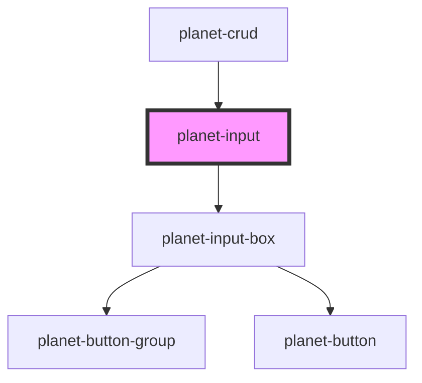

# planet-input

<!-- Auto Generated Below -->

## Properties

| Property     | Attribute    | Description | Type                                                         | Default     |
| ------------ | ------------ | ----------- | ------------------------------------------------------------ | ----------- |
| `label`      | `label`      |             | `string`                                                     | `undefined` |
| `name`       | `name`       |             | `string`                                                     | `'__name'`  |
| `options`    | --           |             | `PlanetValueInterface<any>[]`                                | `undefined` |
| `showHelp`   | `show-help`  |             | `boolean`                                                    | `false`     |
| `showValue`  | `show-value` |             | `boolean`                                                    | `true`      |
| `type`       | `type`       |             | `"autocomplete" \| "select" \| "text" \| "time" \| "toggle"` | `'text'`    |
| `validators` | --           |             | `(() => Validator<PlanetValueInterface<any>>)[]`             | `[]`        |
| `value`      | --           |             | `PlanetValueInterface<any>`                                  | `undefined` |

## Events

| Event     | Description | Type                                     |
| --------- | ----------- | ---------------------------------------- |
| `pChange` |             | `CustomEvent<PlanetValueInterface<any>>` |
| `pHelp`   |             | `CustomEvent<void>`                      |
| `pInput`  |             | `CustomEvent<PlanetValueInterface<any>>` |
| `pSearch` |             | `CustomEvent<void>`                      |

## Dependencies

### Used by

 - [planet-crud](../planet-crud)

### Depends on

- [planet-input-box](../planet-input-box)

### Graph

----------------------------------------------

*Built with [StencilJS](https://stenciljs.com/)*
