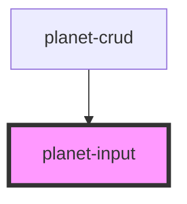

# planet-input

<!-- Auto Generated Below -->

## Properties

| Property     | Attribute | Description | Type                                                | Default     |
| ------------ | --------- | ----------- | --------------------------------------------------- | ----------- |
| `label`      | `label`   |             | `string`                                            | `undefined` |
| `validators` | --        |             | `(() => Validator<PlanetValueInterface<string>>)[]` | `[]`        |
| `value`      | --        |             | `PlanetValueInterface<string>`                      | `undefined` |

## Events

| Event     | Description | Type                                        |
| --------- | ----------- | ------------------------------------------- |
| `changed` |             | `CustomEvent<PlanetValueInterface<string>>` |

## Dependencies

### Used by

 - [planet-crud](../planet-crud)

### Graph

----------------------------------------------

*Built with [StencilJS](https://stenciljs.com/)*
