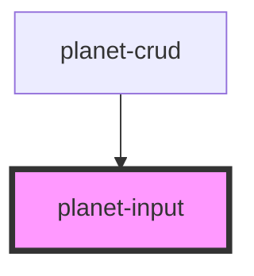

# planet-input

<!-- Auto Generated Below -->

## Properties

| Property     | Attribute | Description | Type                                             | Default                             |
| ------------ | --------- | ----------- | ------------------------------------------------ | ----------------------------------- |
| `label`      | `label`   |             | `string`                                         | `undefined`                         |
| `name`       | `name`    |             | `string`                                         | `'__name'`                          |
| `type`       | `type`    |             | `"text" \| "toggle"`                             | `'text'`                            |
| `validators` | --        |             | `(() => Validator<PlanetValueInterface<any>>)[]` | `[]`                                |
| `value`      | --        |             | `PlanetValueInterface<any>`                      | `{ description: 'x', value: true }` |

## Events

| Event     | Description | Type                   |
| --------- | ----------- | ---------------------- |
| `pChange` |             | `CustomEvent<boolean>` |

## Dependencies

### Used by

 - [planet-crud](../planet-crud)

### Graph

----------------------------------------------

*Built with [StencilJS](https://stenciljs.com/)*
