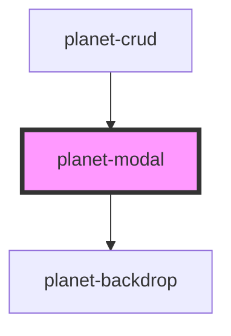

# planet-modal

<!-- Auto Generated Below -->

## Properties

| Property       | Attribute        | Description | Type     | Default     |
| -------------- | ---------------- | ----------- | -------- | ----------- |
| `titleOfModal` | `title-of-modal` |             | `string` | `undefined` |

## Dependencies

### Used by

 - [planet-crud](../planet-crud)

### Depends on

- [planet-backdrop](../planet-backdrop)

### Graph

----------------------------------------------

*Built with [StencilJS](https://stenciljs.com/)*
