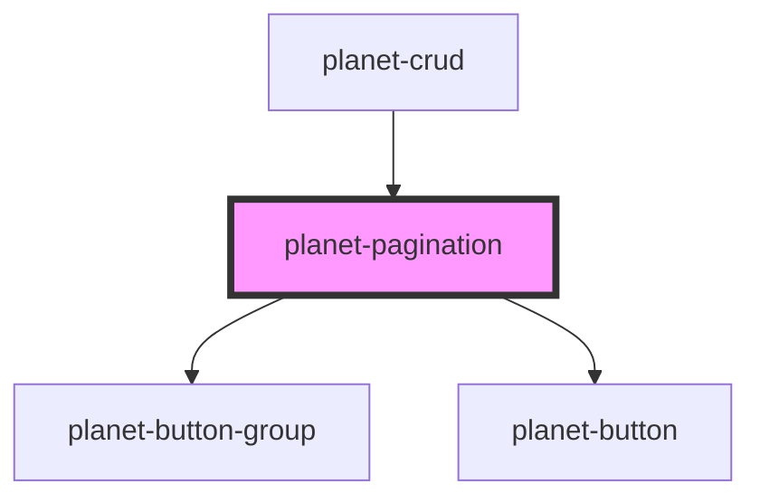

# planet-pagination

<!-- Auto Generated Below -->

## Properties

| Property | Attribute | Description | Type     | Default     |
| -------- | --------- | ----------- | -------- | ----------- |
| `page`   | `page`    |             | `number` | `undefined` |
| `pages`  | `pages`   |             | `number` | `undefined` |

## Dependencies

### Used by

 - [planet-crud](../planet-crud)

### Depends on

- [planet-button-group](../planet-button-group)
- [planet-button](../planet-button)

### Graph

----------------------------------------------

*Built with [StencilJS](https://stenciljs.com/)*
