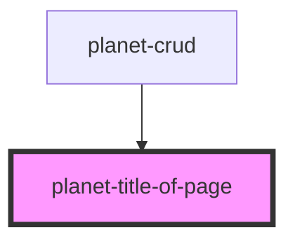

# planet-title-of-page

<!-- Auto Generated Below -->

## Properties

| Property    | Attribute   | Description | Type      | Default     |
| ----------- | ----------- | ----------- | --------- | ----------- |
| `secondary` | `secondary` |             | `boolean` | `undefined` |
| `tertiary`  | `tertiary`  |             | `boolean` | `undefined` |

## Dependencies

### Used by

 - [planet-crud](../planet-crud)

### Graph

----------------------------------------------

*Built with [StencilJS](https://stenciljs.com/)*
